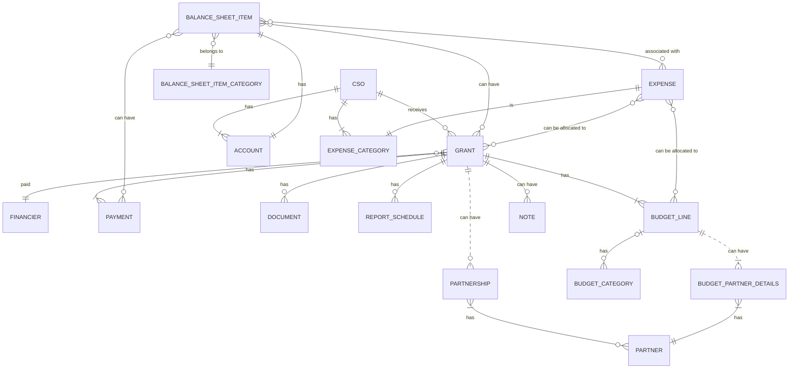
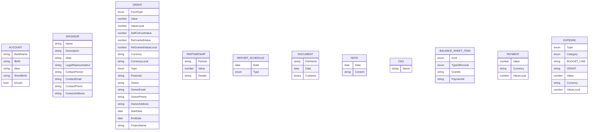

# ER Diagrams

## CO-fund example

---

FUll sum = 100k
Self co-fund value = 10k
Partner#1 co-fund value= 5k
Partner#2 co-fund value= 15k

---

Grant properties:

- Value:100k
- RegrantedValue: `Value` - `self-co-found-value` - SUM(`Partnerships.Values`)
  =(100 - 10 - (5+15)) = 70k (calculated field)
- self-co-found-value: 10k
- Partnerships:

  - partner: Partner#1
    Value: 5k
  - partner: Partner#2
    Value: 15k

- Budget:

  - `category`: Development

    - `description`: UX/UI Design
    - `value`: 3600
    - `re-granted-value`: (value - co-fund-self-value - SUM(Partner. - co-fund-value + Partner.Value)) (calculated field)
    - `co-funded`: true
    - `co-fund-self-value`: 200
    - partners:
      - partner: Partner#1
        `co-fund-value`: 0
        `Value`: 200
      - partner: Partner#2
        co-fund-value: 0
        Value: 0

  - category: administrative
    value: 40k
    co-funded: true
    co-fund-self-value: ?
    co-fund-partners: - partner: Partner#1
    Value: ? - partner: Partner#2
    Value: ?

  - 10k

> Validation rules:
>
> - grant.self-co-fund-value = SUM(BUDGET.co-fund-self-value)
> - grant.Partnerships.partner#X.Value = SUM(BUDGET.co-fund-partners.partner#x.Value)
> - grant.value = SUM(BUDGET.value)
