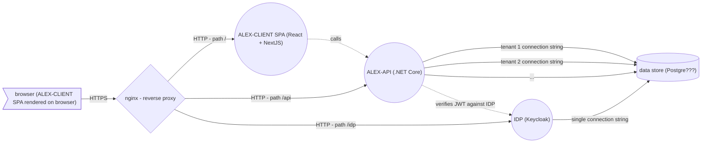

# Reverse proxy

Based on the following architecture:



- _nginx_ 
  - handles SSL termination
  - routes to applications based on path and rules
- _ALEX-CLIENT_
  - React + NextJS SPA
  - static files served by _nginx_ (or full blown _NextJS node_ app???)
    - HTTP server path: ```/```
  - rendered client side
    - calls _ALEX-API_ - API calls initiated from user browser
- _ALEX-API_
  - .NET6.0 application
    - HTTP server path: ```/api```
  - should be 1-to-1 with _OpenAPI_ specs
  - uses same DB as _IDP_
    - uses different DB based on tenant (each tenant with its own DB and connection string)
      - separates based on ```X-Tenant-ID``` HTTP header
- _IDP_ - _Keycloak_
  - should generate JWT token
    - HTTP server path: ```/idp```
  - offers UI for user management, realms, different parameter configuration
  - uses same DB as _ALEX-API_
- _DB_ - data store???